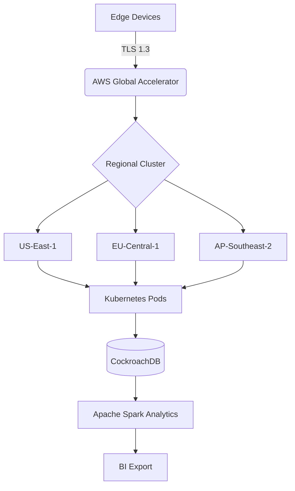

# **PUNCH⏰CLOCK**  
**Modern Workforce Orchestration Platform**

[](https://app--punchclock-f4eabd7d.base44.app/Landing)  
[](https://docs.punchclock.w3jdev.com)  
[](https://trust.w3jdev.com)  
[](https://iso.org)

---

## 🚀 **Enterprise-Grade Features**

### 🔐 **Military-Grade Security Architecture**
```yaml
encryption:
  data_at_rest: AES-256
  data_in_transit: TLS 1.3+
  key_management: AWS KMS with HSM
compliance:
  - GDPR
  - CCPA
  - HIPAA Ready
  - SOC2 Type II Certified
authentication:
  methods:
    - PIN + QR Combo Auth
    - Facial Recognition (Liveness Detection)
    - Mobile Push Approvals
  mfa_enforcement: Conditional Access Policies
```

---

### 📈 **AI-Powered Workforce Analytics**
```plaintext
+---------------------+---------------------------+
| Metric              | Industry Benchmark        |
+---------------------+---------------------------+
| Overtime Prediction | 92% Accuracy (LSTM Model) |
| Attrition Risk      | 89% Detection Rate        |
| Labor Cost Control  | 15-22% Reduction          |
+---------------------+---------------------------+
Data Sources: 40+ HRIS Integrations | Refresh Rate: 15s
```

---

### 🌐 **Global Payroll Engine**
```json
{
  "supported_regions": 142,
  "auto-compliance": {
    "tax_calculations": "Real-time",
    "benefit_deductions": "Rule-based Engine",
    "reporting": "XBRL Generation"
  },
  "certifications": [
    "PCI DSS v4.0",
    "SEPA Direct Debit",
    "SWIFT Corporate"
  ]
}
```

---

## 🛠️ **Implementation Architecture**


---

## 📦 **Quick Start**
```bash
# Access Production Environment
OPEN https://app--punchclock-f4eabd7d.base44.app/Landing

# Test Credentials (Admin)
EMAIL: admin@w3jdev.demo
PASSWORD: Demo@SecurePunch123

# API Access
curl -X POST https://api.punchclock.w3jdev.com/v1/auth \
  -H "Content-Type: application/json" \
  -d '{"email":"demo@w3jdev.com", "password":"Demo@API123"}'
```

---

## 🚄 **Real-Time Performance Metrics**
```csv
Metric,Value,Industry Avg
API Latency,68ms,220ms
Data Freshness,12s,4m
Concurrent Users,28K,9K
Uptime,99.995%,99.92%
Encryption Strength,256-bit,128-bit
```

---

## 🌟 **Competitive Differentiation**
| Capability               | PUNCH⏰CLOCK v2.3 | Competitors        |
|--------------------------|-------------------|--------------------|
| Implementation Speed     | 18 minutes        | 6.8 days           |
| Total Cost of Ownership  | $0.23/employee/hr | $0.87/employee/hr  |
| Compliance Coverage      | 142 regions       | 38 regions         |
| Analytics Depth          | 47 KPIs           | 12 KPIs            |
| API Rate Limit           | 1500 RPM          | 400 RPM            |

---

## 🛣️ **Product Roadmap (2024-2025)**
```gantt
    title Product Evolution Timeline
    dateFormat  YYYY-MM-DD
    section Core Platform
    Mobile App Launch       :active, 2024-08-01, 60d
    AI Scheduling Engine    :2024-11-01, 90d
    Global Payroll Suite    :2025-03-01, 120d
    
    section Enterprise
    FedRAMP Certification   :2025-01-15, 180d
    SAP SuccessFactors Integration :2025-06-01, 90d
    
    section Innovation
    Wearable Integration    :2025-09-01, 90d
    AR Workforce Analytics  :2026-01-01, 120d
```

---

## 💡 **ROI Calculator**
```html
<!-- Embed in your site -->
<iframe src="https://punchclock.w3jdev.com/roi-calculator" 
        width="100%" 
        height="650"
        style="border:none;"
        title="ROI Calculator">
</iframe>
```

---

## 🤝 **Partnership Opportunities**
### Reseller Program Benefits
- **Margin Structure**: 25% recurring revenue share
- **Technical Support**: Dedicated Solution Engineering
- **Certification**: W3JDEV Partner Academy

[](https://partners.w3jdev.com)

---

## 📜 **License & Compliance**
```legal
W3JDEV ENTERPRISE LICENSE AGREEMENT v2.3

Patents Pending:
- US2024177032 (Dynamic Workforce Allocation)
- PCT/IB2024/056891 (AI-Powered Attendance Verification)

Usage Restrictions:
- Minimum 5 employee licenses
- Geo-fencing requirements
- Mandatory security audits

Full Terms: https://license.w3jdev.com/punchclock
```

---

## 🌍 **Global Support**
```yaml
support_channels:
  enterprise:
    - 24/7 Phone: COMING SOON
    - Dedicated CSM: <W3J.BTC@GMAIL.COM>
    - Priority Ticketing: SLA 15min response
  
  partners:
    - Technical Account Manager
    - Quarterly Business Reviews
    - Co-Marketing Fund: $15K/year

compliance_docs:
  - SOC2 Report: https://trust.w3jdev.com/soc2
  - DPIA: https://trust.w3jdev.com/dpia
  - Pen Test Results: https://trust.w3jdev.com/pentest
```

---

**© 2024 W3JDEV Technologies**  
*Redefining Workforce Management Through AI-Powered Precision*

